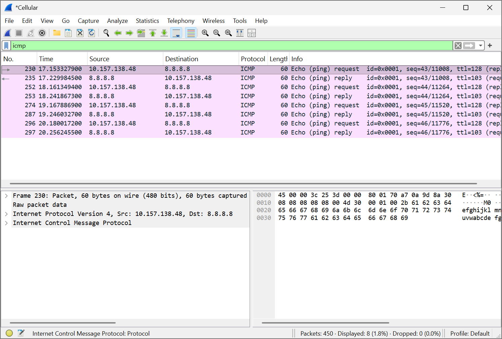
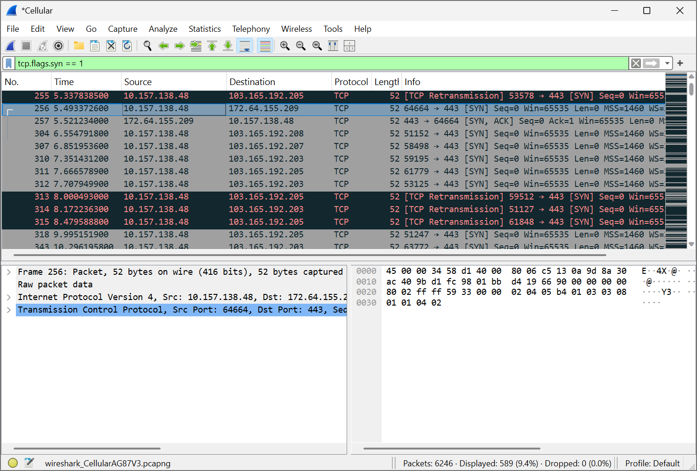
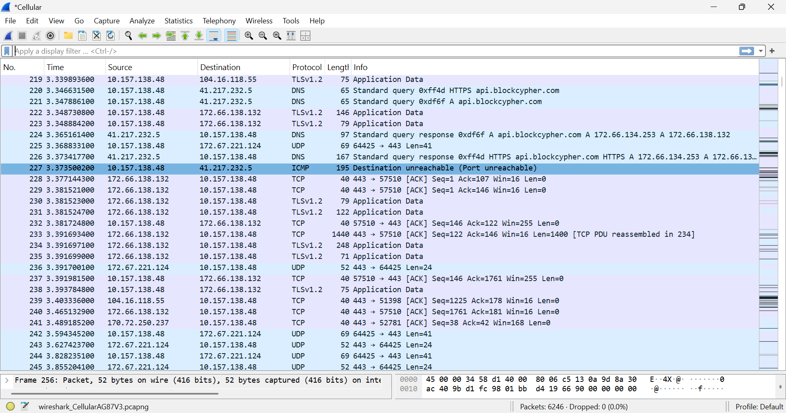

# 🦈 Wireshark Network Traffic Analysis

## 📌 Overview

This project documents my hands-on learning and analysis of network traffic using **Wireshark**, a network protocol analyzer.

The lab involved capturing and examining network packets to understand how different network protocols communicate and how packet information can be used for basic network analysis and troubleshooting.

## 🎯 Objectives

* Understand how to capture and inspect network packets using Wireshark.
* Identify common network protocols and understand their roles in network communication.
* Analyze **ICMP** traffic generated by ping requests and replies.
* Examine **TCP** communication, including SYN and SYN-ACK packets.
* Observe **UDP** and **TLS** traffic in captured network data.
* Develop practical skills in reading and interpreting packet information.
## 🛠️ Tools & Environment

* **Wireshark 4.6.6** — Used to capture and analyze network packets.
* **Windows** — Used for network traffic capture and analysis.
* **Kali Linux** — Used for additional cybersecurity and networking practice.
* **Ping** — Used to generate ICMP traffic for analysis.
* **Google DNS (8.8.8.8)** — Used as a remote destination when generating ICMP traffic.

## 🔍 Network Traffic Analysis

### ICMP Traffic

I generated network traffic by using the `ping` command to send requests to **8.8.8.8**.

In Wireshark, I used the display filter:

`icmp`

This allowed me to isolate ICMP packets from other network traffic.

I observed:

* **ICMP Type 8** — Echo Request sent from my computer.
* **ICMP Type 0** — Echo Reply received from the destination.
* 4 packets were sent and 4 packets were received during the ping test, with **0% packet loss**.

### TCP Traffic

I also examined TCP communication and used Wireshark filters to identify TCP connection-establishment packets.

I observed:

* **SYN** — used to initiate a TCP connection.
* **SYN-ACK** — sent in response to the SYN request.
* **ACK** — completes the TCP three-way handshake.

This helped me understand how TCP establishes a reliable connection between two devices.

### UDP and TLS Traffic

During general traffic capture, I observed packets using **UDP** and **TLS**.

These observations helped me distinguish between different types of network communication and understand how protocols appear in captured packet data.

## 🧠 Key Observations

Through this lab, I learned how to:

* Use Wireshark display filters to focus on specific types of network traffic.
* Distinguish between ICMP Echo Requests and Echo Replies.
* Recognize the TCP three-way handshake using SYN, SYN-ACK, and ACK packets.
* Identify different protocols within captured network traffic.
* Read packet details such as source, destination, protocol, length, and packet information.
* Use packet captures to better understand how devices communicate across a network.

## 📚 What I Learned

This practical exercise strengthened my understanding of network protocols and gave me hands-on experience analyzing real network traffic.

It also helped me connect networking concepts I had studied theoretically with what those concepts look like in actual packet captures.

## 📸 Screenshots

### ICMP Traffic Analysis

The screenshot below shows ICMP Echo Request and Echo Reply packets captured during the ping test to **8.8.8.8**.

### TCP Handshake

The screenshot below shows TCP **SYN** and **SYN-ACK** packets observed during TCP connection establishment.

### Wireshark Traffic Overview

The screenshot below shows a general view of captured network traffic and different protocols observed in Wireshark.
